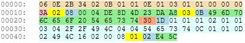
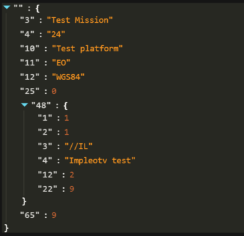

# Klv Data Format


You can use the following data formats for Klv injections:  

**Live packet insertion**:  

- RAW KLV data  
- JSON formatted KLV  

**File (offline processing) packet insertion**:  

- RAW KLV data file (Concatenated RAW KLV data buffers)  
- JSON formatted KLV file (JSON array of packets)  
- CSV file. (MISB 601 records)  


##  RAW KLV

**RAW KLV** format is basically a binary buffer containing MISB601 encoded KLV data  



## JSON formatted KLV

**JSON formatted KLV** is valid JSON object that contains tag : data pairs, where **tag** corresponds to the **MISB 601** (with nested **MISB 0102** and **MISB 0903** (VMTI) data.



>Note, For offline processing, you must supply **klv timestamp** (Tag 2), so the injector could figure out where to insert the packet:  

```
[
  {
    "klvs": {
      "2": 1283400392599311,
      "3": "Frame 0, 00:00:000",
      "13": 32.155127061,
      "14": 34.834800006,
      "15": 0.0,
      "48": {
        "1": 1,
        "2": 1,
        "4": "ImpleoTV Test Mission",
        "12": 2,
        "22": 9
      },
      "65": 9,
      "72": 1490987362175778,
      "1": -7243
    }
  },
  {    
    "klvs": {
      "2": 1283400392957660,
      "3": "Frame 1, 00:00:033",
      "13": 32.155127061,
      "14": 34.834800006,
      "15": 0.0,
      "48": {
        "1": 1,
        "2": 1,
        "4": "ImpleoTV Test Mission",
        "12": 2,
        "22": 9
      },
      "65": 9,
      "72": 1490987362175778,
      "1": 4411
    }
  }
]
```
or
```
[
  {   
    "2": 1283400392599311,
    "3": "Frame 0, 00:00:000",
    "13": 32.155127061,
    "14": 34.834800006,
    "15": 0.0,
    "48": {
      "1": 1,
      "2": 1,
      "4": "ImpleoTV Test Mission",
      "12": 2,
      "22": 9
    },
    "65": 9,
    "72": 1490987362175778
   },
  {   
      "2": 1283400392957660,
      "3": "Frame 1, 00:00:033",
      "13": 32.155127061,
      "14": 34.834800006,
      "15": 0.0,
      "48": {
        "1": 1,
        "2": 1,
        "4": "ImpleoTV Test Mission",
        "12": 2,
        "22": 9
      },
      "65": 9,
      "72": 1490987362175778 
  }
]
```
