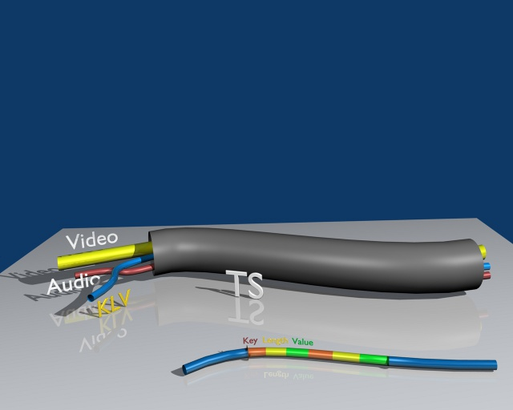
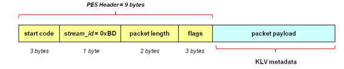
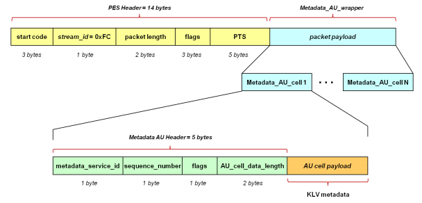
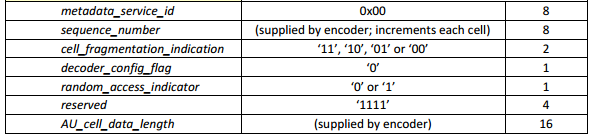

# KLV encoded metadata in STANAG 4609 streams

The MPEG-2 Transport Stream provides an infrastructure for the carriage of video, audio and metadata in a single motion imagery stream as depicted below. KLV (Key-Length-Value) is the current metadata standard recommended by the MISB. It is a SMPTE standard adopted by the MISB for digital encoding of metadata in motion imagery streams. The MISB maintains registries of the KLV metadata tags to be used in support of UAS operations. These tags are called out in MISB Standard 0601.X, which provides guidance on a reliable, bandwidth-efficient exchange of metadata among digital motion imagery systems on UAV platforms.

Below you can see some usefull information from the standards that define methods to time stamp compressed video streams and to transport video and metadata asynchronously or synchronously in compressed motion imagery streams. Implementation methods are defined that leverage the transport layer of MPEG-2 for carriage of motion imagery streams of varying types and bit rates as defined in the Motion Imagery Standards Profile concept of “X on 2”. Specific compressed video formats covered include MPEG-2 and H.264.

## Anatomy of a STANAG 4609 stream

A STANAG 4609 stream is transmitted as a stream of MPEG-2 data (also known as a Transport Stream). Transport stream consists of a set of elementary streams, where each elementary stream can contain either MPEG-2 encoded video, optional audio and encapsulated metadata. Each of these elementary streams has a ‘packet identifier’ (known as a PID) that serves as a unique identifier for that stream within the transport stream. Video and Audio elementary streams consist of continuous set of video frames and audio data samples. They first split  into packets in order to be suitable for multiplexing process. The resulting stream called a packetized elementary stream (PES). In order to create a transport stream, each of these packetized elementary streams stored in transport packets. Each transport packet has a length of 188 bytes. Additionally, some service information tables are added for the identification of the internal TS structure.

## Asynchronous Carriage of Metadata

The transport of KLV metadata over MPEG-2 transport streams in an asynchronous manner is defined in SMPTE RP 217. The metadata PES packets do not use Presentation Time Stamps (PTS) or Metadata Access Unit Wrappers. The relationship between the metadata and the video frames is typically established by their proximity in the video stream. This type of metadata carriage may be used to transport static metadata, or metadata which is not tied closely in time to the video.

### Metadata PES Stream

- The stream_id shall be 0xBD, indicating “private_stream_1.”  
- The data_alignment_indicator shall be set to one when the PES packet contains the beginning of a KLV item, and shall be set to zero otherwise.  
- The delay of any data through the System Target Decoder buffers shall be less than or equal to one second. (This ensures that the metadata is in close proximity to the video frames that it relates to.)  

>  Note: Careful use of the buffer size and leak rate for metadata defined in the System Target Decoder (STD) Model (and as specified in the metadata_std_descriptor) can force a closer proximity of the metadata to the associated frame of video.  

### Program Map Table (PMT)

- The stream_type shall be 0x06, indicating “PES packets containing private data.”  
- The Metadata Stream shall be defined in the PMT as a separate Stream within the same Program as the Video Elementary Stream.  
- For legacy compliance with SMPTE RP 217, the program element loop in the PMT shall contain a registration_descriptor, and the format_identifier field shall be set to 0x4B4C5641 (KLVA).  

The PMT shall contain a metadata_descriptor for each metadata service within the metadata stream. The metadata_descriptor shall be within the descriptor loop for the metadata stream. The metadata_descriptor contains the metadata_service_id for the service it describes. The following values are used to identify metadata types within the metadata_descriptor:  

**metadata_format** = 0xFF (specified by metadata_format_identifier)  
**metadata_format_identifier** = 0x4B4C5641 (KLVA)  

> Note: Earlier versions describe the use of the registration_descriptor to “uniquely and unambiguously identify formats of private data.” The metadata_descriptor, however, provides more functionality, and is therefore specified.   

- The PMT shall contain a single metadata_std_descriptor for the metadata stream.  
- The PMT may contain other descriptors such as the content_labeling_descriptor and the metadata_pointer_descriptor.  

## Synchronous Carriage of Metadata

Several ways to carry metadata over MPEG-2 transport streams are detailed in ISO/IEC 13818-1:2007. MISB STANDARD 0604 specifies the method outlined in ISO/IEC 13818-1:2007 Section 2.12.4 “Use of PES packets to transport metadata” for transporting metadata that is synchronized with the video stream. This method provides a way to synchronize metadata with video using the Presentation Time Stamp (PTS) found in the Packetized Elementary Stream (PES) header. This time stamp is coded in the MPEG-2 Systems PES layer, and is relevant for H.264 as well as MPEG-2. The metadata may or may not be sampled at the same time as a video frame depending upon the system design. If it is sampled at the same time as a video frame, the metadata and video frame will have the same PTS. If the metadata is not sampled at the same time as the video frame, it will be stamped with a different PTS, but exist on the same timeline as the video frame.

In the most common implementation, the packet payload would consist of a single metadata cell that includes a five-byte header followed by KLV metadata.

A metadata service is defined in ISO/IEC 13818 as “a coherent set of metadata of the same format delivered to a receiver for a specific purpose.” When transporting metadata using this service, a unique metadata_service_id is assigned to each service. Each metadata service is represented by a collection of metadata access units that are transported in PES packets.

Details of the implementation of this method are given below.

### Metadata PES Stream

- The stream_id shall be 0xFC, indicating “metadata stream”.  
- Each PES packet shall have a PTS to be used to synchronize the metadata with the video frames.  
- In each PES packet that carries metadata, the first PES packet data byte shall be the first byte of a Metadata Access Unit Cell.  
- The PTS in the PES header shall apply to each Access Unit contained in the PES packet.  
- The PTS shall signal the time that the metadata Access Unit becomes relevant.  
- It is assumed that the metadata is decoded instantaneously (i.e., no DTS shall be coded). If a video frame and a metadata Access Unit have the same PTS, then they were sampled at the same time.  
- Each metadata Access Unit may be carried in one or more Access Unit Cells.  
- The delay of any data through the System Target Decoder buffers shall be less than or equal to one second. (This ensures that the metadata is in close proximity to the video frames that it relates to.)  

> Note: Careful use of the buffer size and leak rate for metadata defined in the System Target Decoder (STD) Model (and specified in the metadata_std_descriptor) can force a closer proximity of the metadata to the associated frame of video.

### Program Map Table (PMT)

- The stream_type shall be 0x15, indicating “Metadata carried in PES packets.”  
- The Metadata Stream shall be defined in the PMT as a separate stream within the same Program as the Video Elementary Stream.  
- The PMT shall contain a metadata_descriptor for each metadata service within the metadata stream. The metadata_descriptor shall be within the descriptor loop for the metadata stream. The metadata_descriptor contains the metadata_service_id for the service it describes. The following values are used to identify metadata types within the metadata_descriptor:  
  

**metadata_format** = 0xFF (specified by metadata format identifier)  
**metadata_format_identifier** = 0x4B4C5641 “KLVA”  

- The PMT shall contain a single metadata_std_descriptor for the metadata stream.  
- The PMT may contain other descriptors such as the content_labeling_descriptor and the metadata_pointer_descriptor.  

  

In the most common implementations, the packet payload will consist of a single metadata Access Unit or Metadata_AU_cell, which includes a five-byte header followed by the KLV metadata. Each metadata Access Unit may be carried in one or more Access Unit Cells.

  

