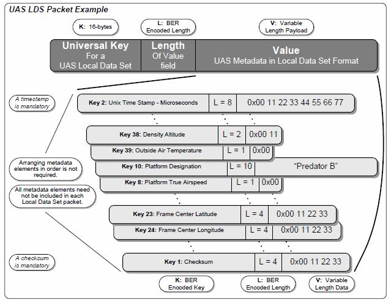
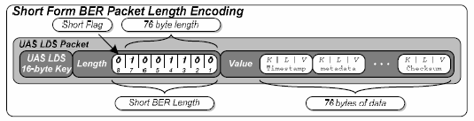
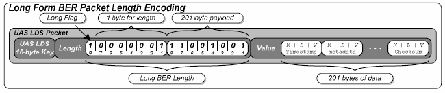

# UAS LDS Packet example

The figure above shows the general format of LDS packet. It is required that each LDS packet contain a Unix-based Coordinated Universal Time (UTC) timestamp that represents the time of birth of the metadata within the LDS packet. A checksum metadata item is also required to be included in each LDS packet. Any combination of metadata items can be included in a UAS Local Data Set packet. Also the items within the UAV LDS can be arranged in any order. However, the timestamp is always positioned at the beginning of an LDS packet and similarly the checksum always appears as the last metadata item due to algorithms surrounding its computation and creation.

# BER Short Form Length Encoding

For UAS LDS packets and data elements shorter than 128 bytes, the length field is encoded using the BER short form. Length field using the short form is a single byte (8 bits). The most significant bit in this byte signals that the long form is being used. The last seven bits depict the number of bytes that follow the BER encoded length. An example LDS packet using a short form encoded length is shown below:

# BER Long Form Length Encoding

For LDS packets and data elements longer than 127 bytes, the length field is encoded using BER long form. The long form encodes length fields using multiple bytes. The first byte indicates long form encoding as well as the number of subsequent bytes that represent the length. The bytes that follow the leading byte are the encoding of an unsigned binary integer equal to the number of bytes in the packet. An example LDS packet using a long form encoded length is shown below:

