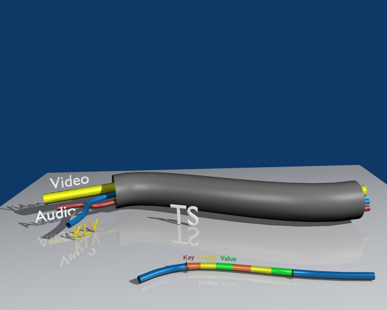

# KLV

## Introduction

**KLV** (Key-Length-Value) is a data encoding standard used for binary data byte-packing and metadata embedding into video feeds. Data is encoded into Key-Length-Value triplets, where **Key** identifies the data, **Length** specifies the data's length, and **Value** is the data itself. It is defined in **SMPTE 336M-2007** (Data Encoding Protocol Using Key-Length Value), approved by the Society of Motion Picture and Television Engineers. KLV encoding protocol defines a data structure which is independent of the application or transportation method used.

**MISBCore** SDK has a KLV encoder / decoder library integrated, so for generic **STANAG 4609** metadata-related tasks there is no need to deal with it explicitly - the user either provides KLV encoded data buffer (at the client-side) and gets the decoded metadata back or (at the server/encoder side) supplies the structured (as JSON) metadata and receives a KLV encoded data buffer.

## Encoding/decoding metadata for Unmanned Air System (UAS)
Unmanned Air Systems use two types of KLV encoded metadata. Universal Data Set (UDS) - the 16-byte key, basic encoding rules (BER) formatted length, and the data value are appropriate for applications where bandwidth isn't a concern. However, transmitting the 16-byte universal key quickly uses up the available bandwidth. UAS airborne platforms use a wireless communications channel where the bandwidth allocated for metadata is limited. Because of the bandwidth disadvantages of using a Universal Data Set, it is more desirable to use a Local Data Set for transmission over a UAS Datalink. Local Data Set can use a 1, 2 or 4-byte key with a 1, 2, 4-byte, or BER-encoded length. For more info about KLV use in UAS applications see [KLV in UAS applications](./klv-in-uas.md)

[1] SMPTE ST 336:2017 Data Encoding Protocol Using Key-Length-Value.  
[2] MISB MISP-2019.1: Motion Imagery Handbook, Nov 2018.