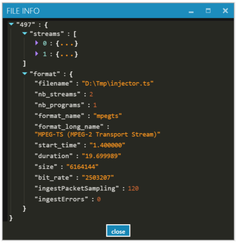
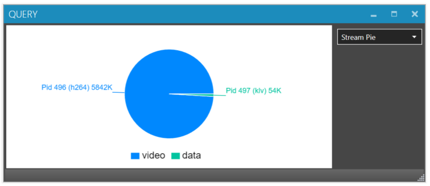
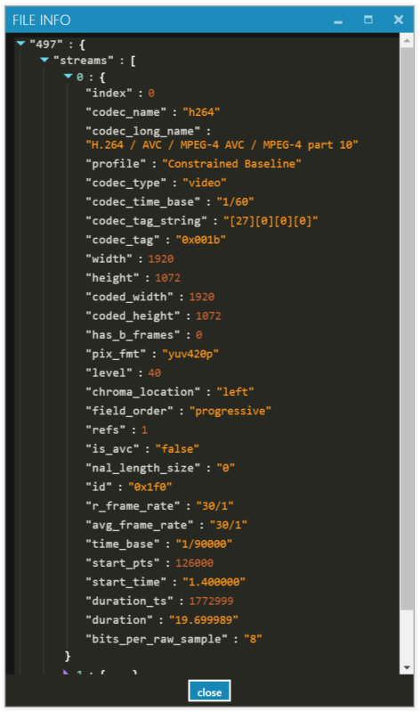
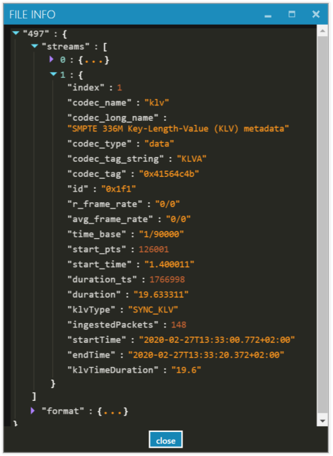
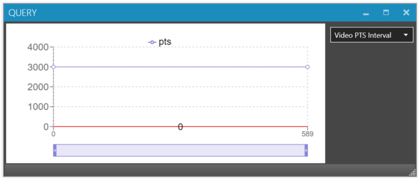
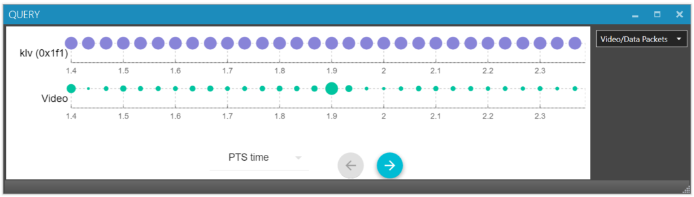

# Validating STANAG stream

We'll be using  <a href="https://www.impleotv.com/content/stplayer/help/index.html">StPlayer application</a> to validate the created stream.

Let's load the recorded file and see what is inside the multiplex.

We can see that the resulted output is a TS file with 2 elementary streams.

Video / metadata packet distribution in the file.

There is a video elementary stream

and Klv data stream

Intervals between the Video timestamps (Pts / Dts) show a perfect line.

And as we've inserted a Klv packet with every video frame, we see the exact correlation in the stream - our video and klvs are in a perfect frame-accurate sync.
