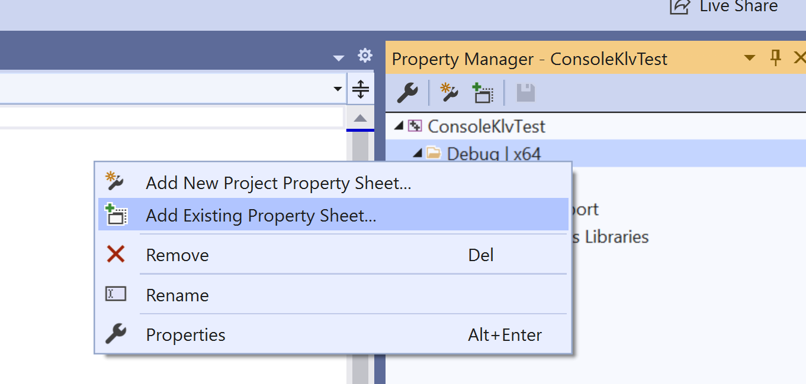

# Using property sheet

**gstreamer-1.0.props** property sheet contains the directories for headers and libraries, plus the necessary options for the compiler and linker.

Go to the **Property Manager** (View→Property Manager), right-click on your project and select “Add Existing Property Sheet...”.

  

Navigate to **GSTREAMER_ROOT_X86\share\vs\2010\libs** and load **gstreamer-1.0.props**.