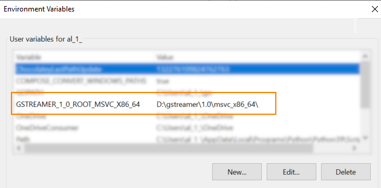
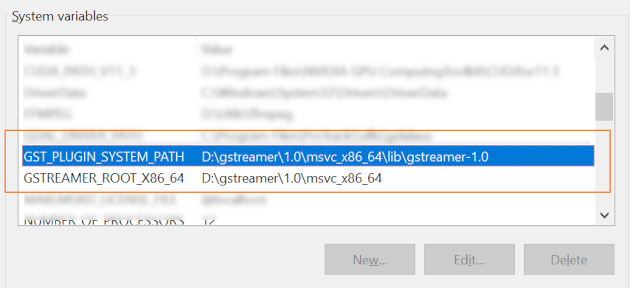
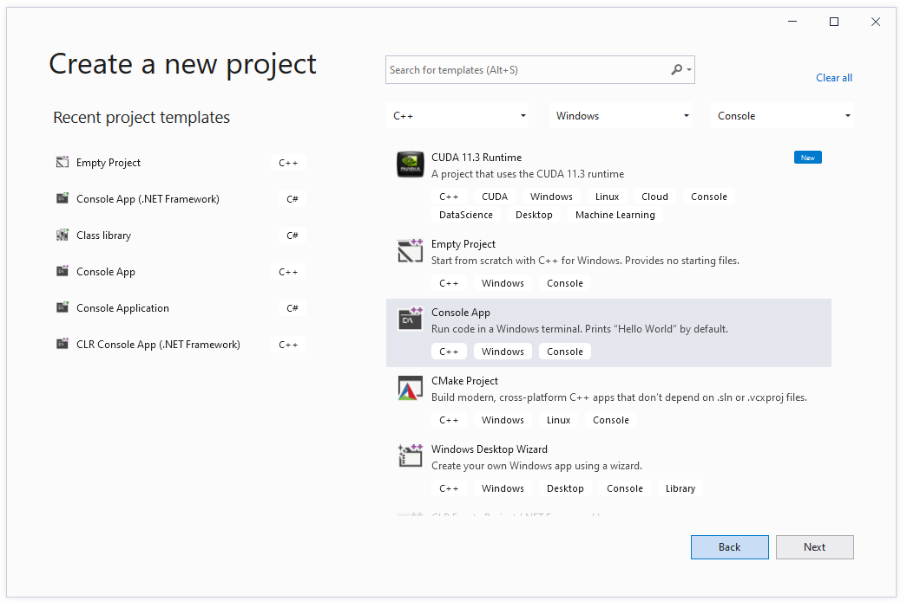

# Visual Studio project

**MisbCoreNative** GStreamer sample app comes with the VS 2019 demo project, so you may simply re-use it.  
If you want to create it from scratch (or add the code to your existing project) here is what you should do:

## Create Visual Studio 2019 project

Make sure you have both **GStreamer** runtime and development installed. 

Note:  
When installing **GStreamer** runtime, do not select **Typical** as you need **gst-plugins-bad** packages. Select **Complete** (or **Custom**, and choose the required modules).

Make sure you have the **GStreamer** root path and plugin path defined.

Select 'Create a new project' and follow the instructions for Windows C++ application creation  

Select **x64** Platform (MisbCoreNative is a 64 bit library). You can remove x86 configuration.

Now you need to define *inlcude* directories, link libraries, etc.  
There are 2 ways to do this:  
- Use [property sheet](./vs-project-props.md)  
or  
- Configure everything [manually](./vs-project-manually.md)

